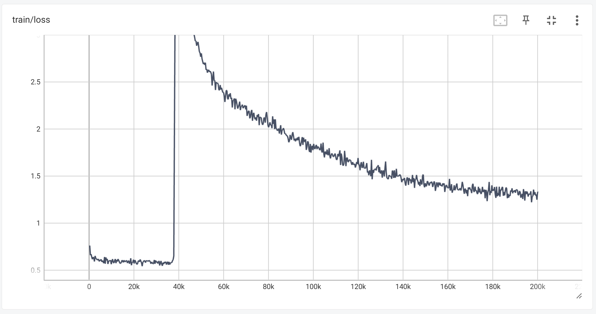
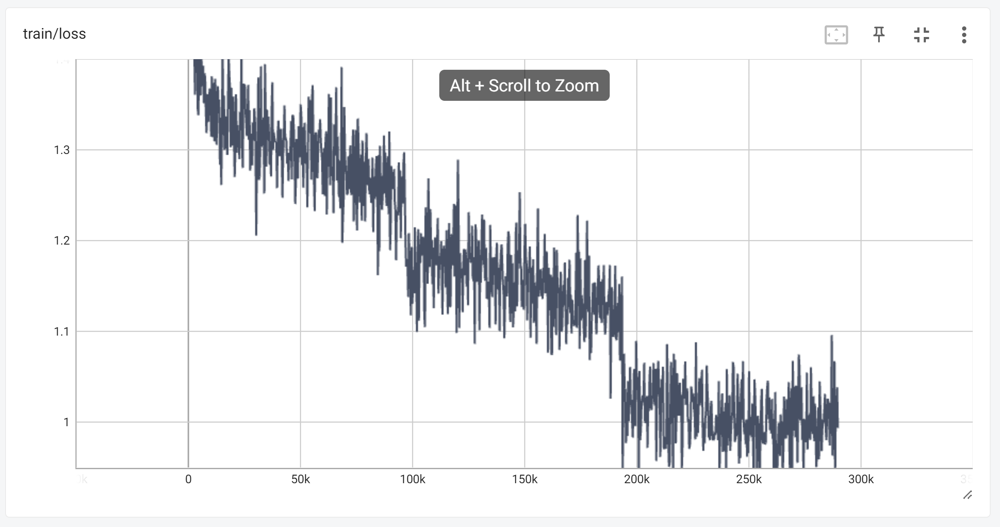
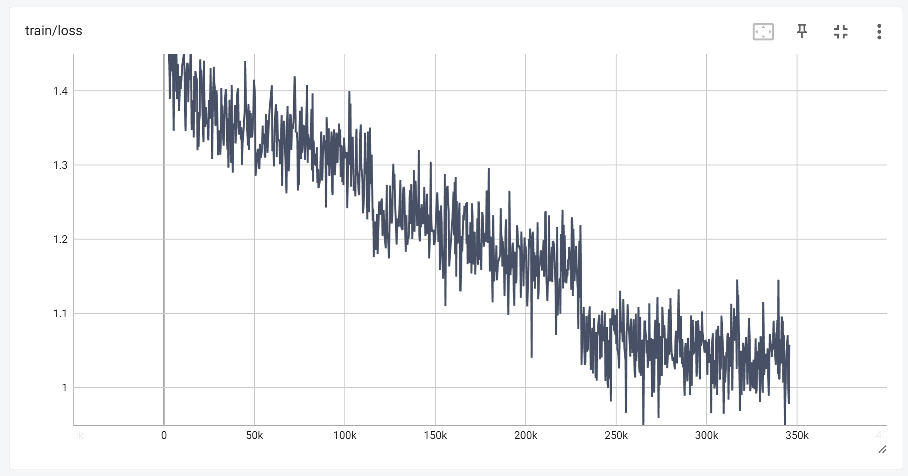

# TranslateDnD
- 번역이 되지 않은 dnd계열 게임을 번역할수 있도록 하기 위한 mini project

## 1. Done
- polyglot-ko-1.3b를 장문번역 한영 데이터베이스 squarelike/sharegpt_deepl_ko_translation[[link](https://huggingface.co/datasets/squarelike/sharegpt_deepl_ko_translation)]로 fine-tuning 완료
- 발더스 게이트2에서 한영 dialog 추출 완료(tlk 파서: [[link](https://github.com/3zhang/TLK-v1-file-parser-for-Python)])
- 추출한 데이터로 데이터셋 구축 완료
- polyglot-ko-5.8b를 장문번역 한영 데이터베이스 squarelike/sharegpt_deepl_ko_translation로 fine-tuning 완료(결과 좋지 않음)
- "squarelike/Gugugo-koen-1.3B-V1.0"에 발더스게이트2 영한 번역 dialog로 fine-tuning 완료(Gugugo_for_DnD_V0.6)
- PoE2 번역 데이터 확보 완료, 데이터에셋에 추가 완료
- "squarelike/Gugugo-koen-1.3B-V1.0"에 발더스게이트2, POE2 영한 번역 dialog로 fine-tuning(Gugugo_for_DnD_V0.7)
- 번역질이 더 좋다는 발더스 게이트1 영한 dialog 확보
- 발더스 게이트3 유저번역 영한 dialog 확보(8월 17일자 패치)

## 2. Now
- "squarelike/Gugugo-koen-1.3B-V1.0"에 발더스게이트2, POE2, 발더스게이트1, 발더스게이트3 유저번역 영한 번역 dialog로 fine-tuning 중


## 3. Future work
- llama 시리즈로 영한 번역이 가능한지 확인

## 4. Road map
- 1. polyglot 계열 모델 중 3090으로 fine-tuning(lora 포함)가능한 모델 결정(매개변수가 최대한 많은 것으로) // Done
- 2. 선택된 모델로 영한 번역 llm으로 훈련(fine-tuning) // Done
    - 일단 데이터 베이스는 [[link](https://huggingface.co/datasets/squarelike/sharegpt_deepl_ko_translation)]
- 3. 기 번역된 dnd 게임에서 영어text와 한글 text 추출 // Done
- 4. 추출된 데이터로 영한번역기로 훈련된 모델 fine-tuning // ing
- 5. 번역되지 않은 dnd 게임의 script 번역 시도 // ing

## 5. Model_1: aeolian83/poly-ko-1.3b-translate
- EleutherAI/polyglot-ko-1.3b을 squarelike/sharegpt_deepl_ko_translation으로 영한 번역만 가능하도록 fine-tuning한 모델
- QLoRA기법으로 fine-tunnig
### (1) 훈련 정보
- GPU: RTX3090 1대
- Epoch: 1
- learning-rate: 3e-4
- batch_size: 3
- Lora r: 8
- Lora target modules: query_key_value  


### (2) 출력 예시
- Gugugo_V1 모델 링크[[GitHub](https://github.com/jwj7140/Gugugo)][[HF](https://huggingface.co/squarelike/Gugugo-koen-1.3B-V1.0)]
```
### 영어: You’re misunderstanding right now. Hear me out.</끝>
### 한국어(Gugugo_V1): 지금 오해하고 계신 것 같습니다. 제 말을 들어보세요.</끝>

### 한국어(poly-ko-1.3b-translate): 지금 오해하고 있습니다. 제 말을 들어주세요.</끝>
```
```
### 영어: New York. CNN. The Federal Aviation Administration has certified for testing a vehicle that a California startup describes as a flying car — the first fully electric vehicle that can both fly and travel on roads to receive US government approval. Alef Automotive said that its vehicle/aircraft, dubbed the “Model A,” is the first flying vehicle that is drivable on public roads and able to park like a normal car. It also has vertical takeoff and landing capabilities. It apparently will be able to carry one or two occupants and will have a road-range of 200 miles and a flying range of 110 miles. The company expects to sell the vehicle for $300,000 each with the first delivery by projected for the end of 2025. The FAA confirmed that it has issued the company a special airworthiness certificate, allowing for limited purposes that include exhibition, research and development. Numerous companies are working on all-electric VTOLs, which stands for vehicle takeoff and landing aircraft. The FAA said that Alef is “not the first aircraft of its kind” to get a special airworthiness certificate. However, Alef noted that its vehicle is different because of its ability to function both on roads and in the air, to appear like a normal car and to park in a normal parking space.</끝>

### 한국어(Gugugo_V1): 뉴욕 CNN. 연방 항공국은 캘리포니아 스타트업이 미국 정부의 승인을 받기 위해 도로를 주행하고 여행할 수 있는 첫 번째 전기 자동차인 \'비행 자동차\'로 묘사되는 차량을 테스트하기 위해 인증받았습니다. 알레프 오토모티브는 차량/항공기를 \'모델 A\'라고 부르며, 공공 도로에서 주행할 수 있고 일반 자동차처럼 주차할 수 있는 첫 번째 비행 자동차입니다. 또한 수직 이착륙 능력이 있습니다. 2025년 말까지 1대당 30만 달러에 판매할 수 있을 것으로 예상됩니다. 이 회사는 2025년 말까지 1대당 30만 달러에 차량을 판매할 수 있다고 예상합니다. 연방 항공국은 2025년 말까지 프로젝트를 통해 차량을 특별한 항공 안전 인증서를 발급할 것이라고 밝혔습니다. FAA는 이 회사가 차량이 이륙하고 착륙하는 데 필요한 특별한 안전 인증서를 발급했다고 확인했습니다. FAA는 Alef가 "이 기종의 첫 번째 항공"이라며 특별한 안전 인증서를 발급받을 자격이 있다고 밝혔습니다. 그러나 Alef는 차량이 도로와 공중에서 모두 작동하는 기능이 달라 일반 자동차처럼 보이고 일반 주차 공간에 주차할 수 있기 때문에 차량이 다르다고 언급했습니다.</끝>

### 한국어(poly-ko-1.3b-translate):뉴욕. CNN. 연방 항공청은 캘리포니아 스타트업이 도로를 통해 비행하고 미국 정부의 승인을 받을 수 있는 최초의 완전 전기 자동차인 \'플라잉 카\'로 설명하는 차량을 테스트하기 위해 인증을 받았습니다. 알레프 오토모티브는 차량/항공기를 "모던"이라고 부르며, 일반 차량처럼 주차할 수 있는 최초의 플라잉 카라고 설명합니다. 수직 이착륙 및 착륙 기능도 갖추고 있습니다. 한 대 또는 두 대를 운송할 수 있으며 도로 주행 가능 거리는 200마일, 비행 가능 거리는 110마일입니다. 이 회사는 2025년 말까지 차량을 3만 달러에 판매할 계획입니다. 미국 교통부는 2025년 말까지 회사에 특별한 항공 보안 증명서를 발급할 것이라고 확인했습니다. 미국 교통부는 이 회사에 전시, 연구 및 개발을 포함한 제한된 목적으로만 사용할 수 있는 특별한 항공 증명서를 발급했다고 밝혔습니다. 수많은 기업이 차량 이착륙 및 비행 항공기를 의미하는 모든 전기 이착륙 항공기를 개발하고 있습니다. 미국 교통부는 알레프가 "일반 차량 중 최초"이기 때문에 특별한 항공 증명서를 받을 수 있다고 밝혔습니다. 그러나 알레프는 차량이 도로에서 작동하고 공중에서도 작동하기 때문에 일반 차량처럼 보이고 일반 주차장에 주차할 수 있는 능력으로 인해 차량이 다르다고 지적했습니다.</끝>
```

## 6. Model_2: aeolian83/poly-ko-5.8b-translate
- EleutherAI/polyglot-ko-5.8b을 squarelike/sharegpt_deepl_ko_translation으로 영한 번역만 가능하도록 fine-tuning한 모델
- QLoRA기법으로 fine-tunnig
### (1) 훈련 정보
- GPU: RTX3090 1대
- Epoch: 1
- learning-rate: 3e-4
- batch_size: 1
- Lora r: 8
- Lora target modules: query_key_value 

- 훈련중 loss가 폭증하는 문제가 발생해 원인을 분석중
- 모델 성능이 매우 안좋은 관계로 따로 번역 예는 비공개

## 7. Model_3: aeolian83/Gugugo_for_DnD_v0.6
- squarelike/Gugugo-koen-1.3B-V1.0 이 번역모델을 DnD계열 게임데이터로 fine-tuning한 모델
- QLoRA기법으로 fine-tunnig
### (1) 훈련 정보
- GPU: RTX3090 1대
- Epoch: 1
- learning-rate: 3e-4
- batch_size: 1
- Lora r: 8
- Lora target modules: query_key_value  


args=transformers.TrainingArguments(  
        per_device_train_batch_size=1,  
        gradient_accumulation_steps=1,  
        fp16=True,  
        output_dir="outputs",  
        save_total_limit=5,  
        logging_steps=300,  
        report_to=["tensorboard"],  
        num_train_epochs = 3,  
        learning_rate=3e-4,  
        resume_from_checkpoint=True,  
        lr_scheduler_type= "cosine",  

### (2) 출력 예시(PillarsOfEternityII, 스크립트로 평가)
```
### 영어: The Steward informed me that a mysterious package has somehow arrived on my ship. I should speak with her to learn more.

### 한글(Gugugo_for_DnD): 관리자는 나에게 신비한 물건이 내 배에 도착했다고 말했소. 그녀와 이야기를 해봐야겠소.

### 한글(deepL): 스튜어드가 의문의 소포가 제 배에 도착했다고 알려주었습니다. 자세한 내용은 그녀와 이야기해봐야겠어요.

### 한글(공식번역): 집사가 알려주기를, 이상한 꾸러미가 의문의 경로를 통해 내 선박에 도착했다고 한다. 집사와 대화해 정보를 얻어야겠다.
```

```
### 영어: I've found myself in some sort of tournament, replete with spectators. I'm told that <b>Humaire</b> is the custodian of this place, and may be able to provide answers regarding the strange invitation. She is currently <b>topside,</b> watching the events.

### 한글(Gugugo_for_DnD): 나는 일종의 토너먼트에 참가하게 되었고, 구경꾼들과 함께 있게 되었다. 나는 <b>Humaire</B>가 이 장소의 수호자라고 들었고, 이상한 초대에 대한 답을 제공할 수 있을 것이다. 그녀는 현재 <b>의 위치에 있다.

### 한글(deepL): I've found myself in some sort of tournament, replete with spectators. I'm told that <b>Humaire</b> is the custodian of this place, and may be able to provide answers regarding the strange invitation. She is currently <b>topside,</b> watching the events.

### 한글(공식번역): 관중들로 가득한 결투장에 도착하게 되었다. 이곳의 관리인인 <b>후마이리</b>로부터 이상한 초대에 대한 대답을 들을 수 있을 지도 모른다는 말을 들었다. 그녀는 현재 <b>상석</b>에서 경기를 지켜보고 있다.
```

```
### 영어: <b>Humaire</b> told me to speak with her in the <b>Hall of Memories</b> on the <b>west side of the temple</b> beneath the arena.

### 한글(Gugugo_for_DnD): <b>휴머레이트</b>가 <b>기억의 전당</b>의 <b>서쪽에 있는 <b>사원에서 그녀와 이야기하라고 했소.

### 한글(deepL): <b>Humaire</b> told me to speak with her in the <b>Hall of Memories</b> on the <b>west side of the temple</b> beneath the arena.

### 한글(공식번역): <b>후마이리</b>는 내게 결투장 밑의 <b>신전 서쪽</b>에 있는 <b>기억의 전당</b>으로 와 자신과 얘기를 나누라고 했다.
```

## 8. Model_4: aeolian83/Gugugo_for_DnD_v0.7
- squarelike/Gugugo-koen-1.3B-V1.0 이 번역모델을 DnD계열 게임데이터로 fine-tuning한 모델
- QLoRA기법으로 fine-tunnig
### (1) 훈련 정보
- GPU: RTX3090 1대
- Epoch: 3
- learning-rate: 3e-4
- batch_size: 1
- Lora r: 8
- Lora target modules: query_key_value  


args=transformers.TrainingArguments(  
        per_device_train_batch_size=1,  
        gradient_accumulation_steps=1,  
        fp16=True,  
        output_dir="outputs",  
        save_total_limit=5,  
        logging_steps=300,  
        report_to=["tensorboard"],  
        num_train_epochs = 3,  
        learning_rate=3e-4,  
        resume_from_checkpoint=True,  
        lr_scheduler_type= "cosine",  

### (2) 출력 예시(Baldur's Gate3, 스크립트로 평가)
```
### 영어: That's true, I won't lie. But I won't let you march towards Moonrise without knowing what you'd face.

### 한글(Gugugo_for_DnD_V0.7): 사실이에요. 거짓말은 하지 않겠어요. 하지만 당신이 무엇을 마주할지 알지 못한 채로 문리사와 함께 문 앞으로 행진하게 두지는 않겠어요.

### 한글(deepL): 사실이야, 거짓말은 하지 않을게. 하지만 어떤 일이 벌어질지 모른 채 문라이즈를 향해 행진하도록 내버려두지는 않을 겁니다.

### 한글(유저번역): 그건 사실이야, 거짓을 말하진 않겠네. 하지만 그대가 뭘 맞이할지도 모르는 채로 문라이즈 타워로 나아가도록 놔둘 순 없지.
```
```
### 영어: <i>A bold strategy. It is not many that can defeat their own minds.</i>

### 한글(Gugugo_for_DnD_V0.7): <i>대단한 전략이군. 그들의 마음을 정복할 수 있는 자는 많지 않을 거야.</i>

### 한글(deepL): <i>A bold strategy. It is not many that can defeat their own minds.</i>

### 한글(유저번역):<i>대담한 전략이군요. 자신의 정신을 이겨낼 수 있는 이들은 많지 않은데 말이죠.</i>
```

```
### 영어: If a spell forces you to make a Dexterity <LSTag Tooltip="SavingThrow">Saving Throw</LSTag>, you can use a reaction to shield yourself and diminish the effect\'s damage. <br><br>On a failed save, you only take half damage. On a successful save, you don\'t take any damage, even if you normally would.

### 한글(Gugugo_for_DnD_V0.7): 만약 주문이 당신에게 민첩 <LSTag Toolip="SavingThrow"</LSTag> 내성 굴림="내성 굴림"을 주면, 당신은 반사를 사용하여 자신을 보호하고, 효과의 피해를 줄일 수 있다. 브라우저의 실패로 인해, 당신은 반사를 받지 않아도, 당신이 평소에는 그랬던 것처럼, 아무런 피해도 받지 않는다.

### 한글(deepL): If a spell forces you to make a Dexterity <LSTag Tooltip="SavingThrow">Saving Throw</LSTag>, you can use a reaction to shield yourself and diminish the effect\'s damage. <br><br>On a failed save, you only take half damage. On a successful save, you don\'t take any damage, even if you normally would.

### 한글(유저번역):주문이 민첩 <LSTag Tooltip="SavingThrow">내성 굴림</LSTag>을 강요하는 경우, 반응 행동을 사용해 스스로를 방어하고 효과의 피해를 감쇠할 수 있습니다. \n\n굴림에 실패한 경우, 절반의 피해만 입습니다. 굴림에 성공한 경우, 어떤 피해도 입지 않습니다.
```
```
### 영어: After surviving a poor and bleak childhood, you know how to make the most out of very little. Using your street smarts bolsters your spirit for the journey ahead.

### 한글(Gugugo_for_DnD_V0.7): 가난하고 어두운 어린 시절을 보낸 후에는, 얼마나 많은 것을 얻을 수 있는지 알고 있을 거요. 당신의 거리의 지혜를 이용하면 앞으로 나아갈 여정에 당신의 영혼을 불어넣을 수 있소.

### 한글(deepL): 가난하고 암울한 어린 시절을 살아남은 여러분은 적은 것을 최대한 활용하는 방법을 알고 있습니다. 길거리에서 얻은 지혜를 활용하면 앞으로의 여정을 위한 정신력을 강화할 수 있습니다.

### 한글(유저번역):가난하고 암울한 어린 시절을 생존해낸 당신은 가장 작은 것조차도 최대한 활용하는 방법을 알고 있습니다. 당신의 길거리 지식을 활용하면 앞으로의 여정을 위한 사기를 북돋울 수 있을 것입니다.
```

## 9. Model_5: aeolian83/Gugugo_for_DnD_v0.8
- squarelike/Gugugo-koen-1.3B-V1.0 이 번역모델을 DnD계열 게임데이터로 fine-tuning한 모델
- QLoRA기법으로 fine-tunnig
### (1) 훈련 정보
- GPU: RTX3090 1대
- Epoch: 3
- learning-rate: 3e-4
- batch_size: 1
- Lora r: 8
- Lora target modules: query_key_value  


### (2) 출력 예시(Baldur's Gate3, 스크립트로 평가, 훈련데이터로 들어가지 않은 데이터 중에서 새로 번역된 유저번역과 비교)
```
### 영어: They are <i>gifts</i> to my Queen from the goddess Tiamat herself. They reside in the great city of Tu'narath, awaiting the privilege of battle.

### 한글(Gugugo_for_DnD_V0.8): 여신 티아마트의 <i>선물</i>이 내 여왕님께 가 있다. 그들은 여신 티아마트의 위대한 도시에서 살고 있다. 전투의 특권을 기다리며.

### 한글(deepL): 사실이야, 거짓말은 하지 않을게. 하지만 어떤 일이 벌어질지 모른 채 문라이즈를 향해 행진하도록 내버려두지는 않을 겁니다.

### 한글(유저번역): 드래곤들은 티아마트 여신께서 직접 우리 여왕에게 주신 <i>선물</i>이지. 그들은 위대한 도시 투나라스에 머물며, 전투의 특권을 기다리는 중이다.
```

```
### 영어: <LSTag Type="Image" Info="SoftWarning"/> Can't be summoned again if killed in combat.

### 한글(Gugugo_for_DnD_V0.8): <LSTag Type="Image" Info="SoftWarning"/> 전투 중에 죽으면 다시 소환할 수 없습니다.

### 한글(유저번역): 전투에서 죽으면 다시 소환할 수 없습니다. 
```

```
### 영어: You can't try to charm the creature again until your next <LSTag Tooltip="LongRest">Long Rest</LSTag>.

### 한글(Gugugo_for_DnD_V0.8): 다음 <LSTag Tooltip="LongRest">긴 휴식</LSTag>이 될 때까지는, 크리쳐를 현혹하려 하지 마십시오.

### 한글(유저번역): <LSTag Tooltip="LongRest">긴 휴식</LSTag> 전에는 크리처를 매혹할 수 없습니다. 
```

```
### 영어: *Humming.*

### 한글(Gugugo_for_DnD_V0.8): *웅웅.*

### 한글(유저번역): *흥얼거린다.*
```

```
### 영어: Despite no ancestral links to the mighty creatures, these dragonborn share the glinting shine and scorching cold breath of silver dragons.

### 한글(Gugugo_for_DnD_V0.8): 강력한 생물들과 조상이 연결되어 있지 않음에도 불구하고, 이 드래곤본은 빛나는 빛을 내뿜으며 실버 드래곤의 냉기를 뿜어냅니다.

### 한글(유저번역): 실버 드래곤의 후손은 아니지만, 이 드래곤본들은 그 위대한 생물과 같은 번뜩이는 광택과 맹렬하고도 차가운 숨결을 가지고 있습니다.
```


# Inform
- llm fine-tuning에 관해 공부하면서 진행하는 mini project입니다. 
- 레퍼런스[https://github.com/jwj7140/Gugugo]
- 저작권 문제로 데이터셋은 공개되지 않을 수도 있습니다. 
- 모델 성능이 괜찮아도, 마찮가지로 저작권 문제로 모델이 공개되지 않을 수도 있습니다. 