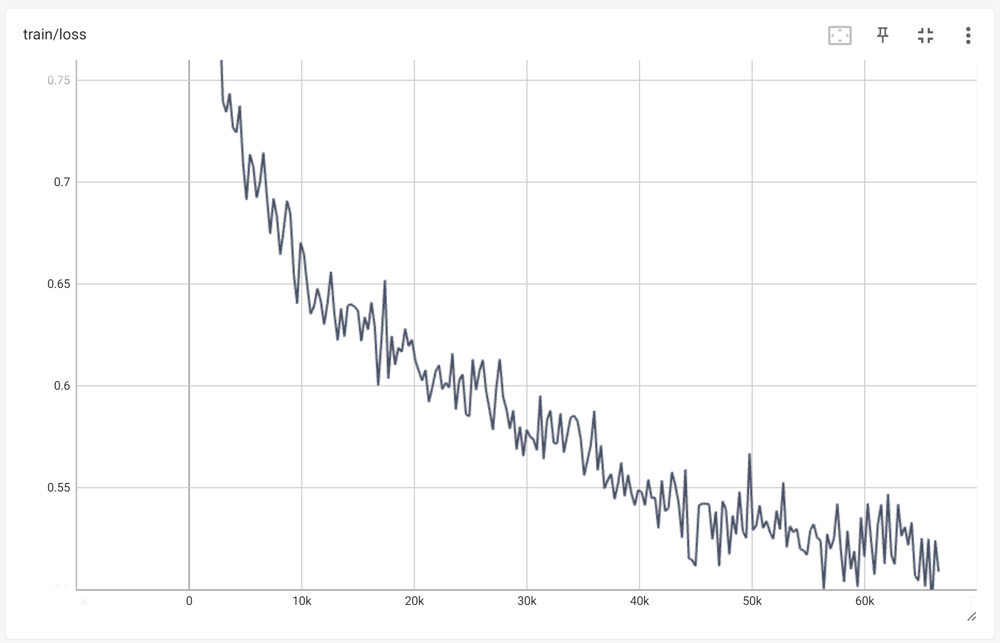

# TranslateDnD
- 번역이 되지 않은 dnd계열 게임을 번역할수 있도록 하기 위한 mini project

## 1. Done
- polyglot-ko-1.3b를 장문번역 한영 데이터베이스 squarelike/sharegpt_deepl_ko_translation[[link](https://huggingface.co/datasets/squarelike/sharegpt_deepl_ko_translation)]로 fine-tuning 완료
- 발더스 게이트2에서 한영 dialog 추출 완료(tlk 파서: [[link](https://github.com/3zhang/TLK-v1-file-parser-for-Python)])

## 2. Now
- polyglot-ko-5.8b를 장문번역 한영 데이터베이스 squarelike/sharegpt_deepl_ko_translation로 fine-tuning 중
- 번역질이 더 좋다는 발더스 게이트1 영한 dialog 수배중

## 3. Future work
- llama 시리즈로 영한 번역이 가능한지 확인

## 4. Road map
- 1. polyglot 계열 모델 중 3090으로 fine-tuning(lora 포함)가능한 모델 결정(매개변수가 최대한 많은 것으로)  
- 2. 선택된 모델로 영한 번역 llm으로 훈련(fine-tuning)
    - 일단 데이터 베이스는 [[link](https://huggingface.co/datasets/squarelike/sharegpt_deepl_ko_translation)]
- 3. 기 번역된 dnd 게임에서 영어text와 한글 text 추출
- 4. 추출된 데이터로 영한번역기로 훈련된 모델 fine-tuning
- 5. 번역되지 않은 dnd 게임의 script 번역 시도

## 5. Model1: aeolian83/poly-ko-1.3b-translate
- EleutherAI/polyglot-ko-1.3b을 squarelike/sharegpt_deepl_ko_translation으로 영한 번역만 가능하도록 fine-tuning한 모델
- QRoLA기법으로 fine-tunnig
### (1)훈련 정보
- GPU: RTX3090 1대
- Epoch: 1
- learning-rate: 3e-4
- batch_size: 3
- Lora r: 8
- Lora target modules: query_key_value  



### 출력 예시
```
### 영어: You’re misunderstanding right now. Hear me out.</끝>
### 한국어(Gugugo_V1): 지금 오해하고 계신 것 같습니다. 제 말을 들어보세요.</끝>

### 한국어(poly-ko-1.3b-translate): 지금 오해하고 있습니다. 제 말을 들어주세요.</끝>
```
```
### 영어: New York. CNN. The Federal Aviation Administration has certified for testing a vehicle that a California startup describes as a flying car — the first fully electric vehicle that can both fly and travel on roads to receive US government approval. Alef Automotive said that its vehicle/aircraft, dubbed the “Model A,” is the first flying vehicle that is drivable on public roads and able to park like a normal car. It also has vertical takeoff and landing capabilities. It apparently will be able to carry one or two occupants and will have a road-range of 200 miles and a flying range of 110 miles. The company expects to sell the vehicle for $300,000 each with the first delivery by projected for the end of 2025. The FAA confirmed that it has issued the company a special airworthiness certificate, allowing for limited purposes that include exhibition, research and development. Numerous companies are working on all-electric VTOLs, which stands for vehicle takeoff and landing aircraft. The FAA said that Alef is “not the first aircraft of its kind” to get a special airworthiness certificate. However, Alef noted that its vehicle is different because of its ability to function both on roads and in the air, to appear like a normal car and to park in a normal parking space.</끝>

### 한국어(V1): 뉴욕 CNN. 연방 항공국은 캘리포니아 스타트업이 미국 정부의 승인을 받기 위해 도로를 주행하고 여행할 수 있는 첫 번째 전기 자동차인 \'비행 자동차\'로 묘사되는 차량을 테스트하기 위해 인증받았습니다. 알레프 오토모티브는 차량/항공기를 \'모델 A\'라고 부르며, 공공 도로에서 주행할 수 있고 일반 자동차처럼 주차할 수 있는 첫 번째 비행 자동차입니다. 또한 수직 이착륙 능력이 있습니다. 2025년 말까지 1대당 30만 달러에 판매할 수 있을 것으로 예상됩니다. 이 회사는 2025년 말까지 1대당 30만 달러에 차량을 판매할 수 있다고 예상합니다. 연방 항공국은 2025년 말까지 프로젝트를 통해 차량을 특별한 항공 안전 인증서를 발급할 것이라고 밝혔습니다. FAA는 이 회사가 차량이 이륙하고 착륙하는 데 필요한 특별한 안전 인증서를 발급했다고 확인했습니다. FAA는 Alef가 "이 기종의 첫 번째 항공"이라며 특별한 안전 인증서를 발급받을 자격이 있다고 밝혔습니다. 그러나 Alef는 차량이 도로와 공중에서 모두 작동하는 기능이 달라 일반 자동차처럼 보이고 일반 주차 공간에 주차할 수 있기 때문에 차량이 다르다고 언급했습니다.</끝>

### 한국어(poly-ko-1.3b-translate):뉴욕. CNN. 연방 항공청은 캘리포니아 스타트업이 도로를 통해 비행하고 미국 정부의 승인을 받을 수 있는 최초의 완전 전기 자동차인 \'플라잉 카\'로 설명하는 차량을 테스트하기 위해 인증을 받았습니다. 알레프 오토모티브는 차량/항공기를 "모던"이라고 부르며, 일반 차량처럼 주차할 수 있는 최초의 플라잉 카라고 설명합니다. 수직 이착륙 및 착륙 기능도 갖추고 있습니다. 한 대 또는 두 대를 운송할 수 있으며 도로 주행 가능 거리는 200마일, 비행 가능 거리는 110마일입니다. 이 회사는 2025년 말까지 차량을 3만 달러에 판매할 계획입니다. 미국 교통부는 2025년 말까지 회사에 특별한 항공 보안 증명서를 발급할 것이라고 확인했습니다. 미국 교통부는 이 회사에 전시, 연구 및 개발을 포함한 제한된 목적으로만 사용할 수 있는 특별한 항공 증명서를 발급했다고 밝혔습니다. 수많은 기업이 차량 이착륙 및 비행 항공기를 의미하는 모든 전기 이착륙 항공기를 개발하고 있습니다. 미국 교통부는 알레프가 "일반 차량 중 최초"이기 때문에 특별한 항공 증명서를 받을 수 있다고 밝혔습니다. 그러나 알레프는 차량이 도로에서 작동하고 공중에서도 작동하기 때문에 일반 차량처럼 보이고 일반 주차장에 주차할 수 있는 능력으로 인해 차량이 다르다고 지적했습니다.</끝>
```


# Inform
- llm fine-tuning에 관해 공부하면서 진행하는 mini project입니다. 
- 레퍼런스[https://github.com/jwj7140/Gugugo]
- 저작권 문제로 데이터셋은 공개되지 않을 수도 있습니다. 
- 모델 성능이 괜찮아도, 마찮가지로 저작권 문제로 모델이 공개되지 않을 수도 있습니다. 